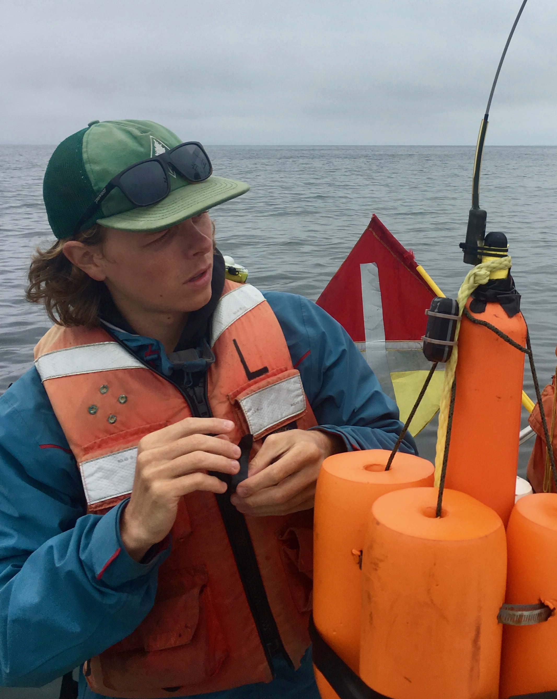
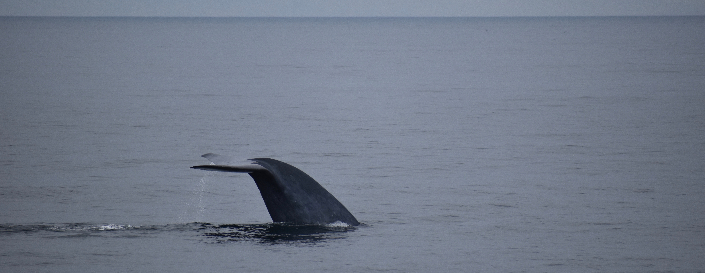

<link rel="stylesheet" href="styles.css" type="text/css">

Our ability to effectively manage marine ecosystems and design conservation approaches for migratory species relies on an understanding of the connections between animal behavior and ecoystem dynamics. However, our capacity to observe animal behavior and ecosystem dynamics -and especially our understanding of the connections between- remain limited, especially in marine ecosystems. My research explores the intersection of oceanography, behavioral ecology, and human resource use to address these gaps. 

I currently conduct this research as a PhD Candidate at [Hopkins Marine Station of Stanford University](https://hopkinsmarinestation.stanford.edu/), where I am the David and Lucile Packard Foundation Stanford Graduate Fellow and a National Science Foundation Graduate Research Fellow. Before my PhD studies, I received both my BS and MS degrees in environmental engineering from Northwestern University and held positions at the Woods Hole Oceanographic Institution (WHOI) and the Natural Resources Defense Council (NRDC).

Image credits: Top - Millie Chapman. All other photos by Will Oestreich unless otherwise indicated.