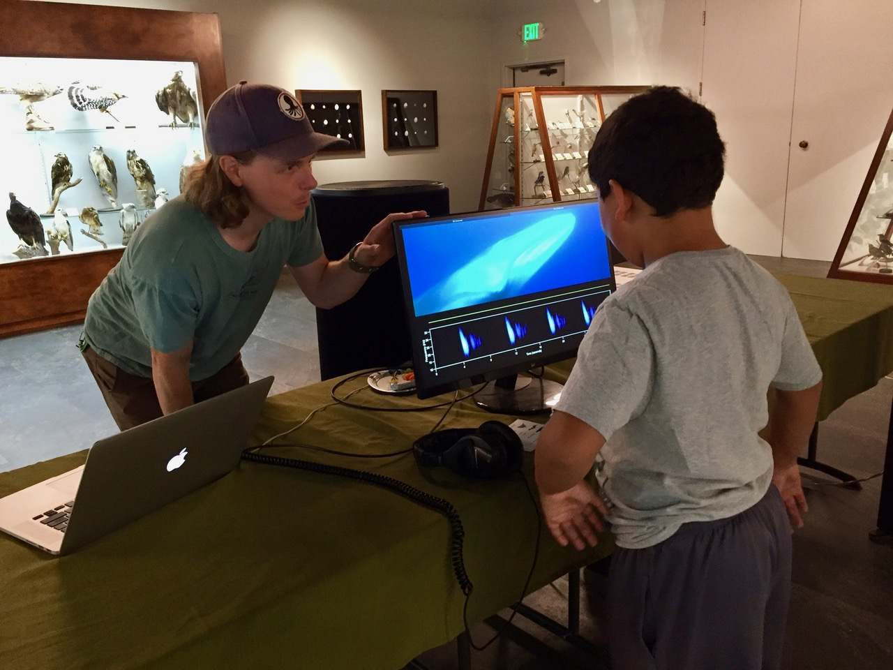

Outreach and education are central to my personal goals as both a scientist and citizen. These activities, with an emphasis on equitable and inclusive approaches, are inseperable from improving research and conservation efforts in the environmental sciences. Without a focus on including diverse voices and perspectives, we fall well short of the most just and innovative outcomes in our field. Much like with my research, I aim to consistently educate myself in these areas while also putting what I learn into practice. My major outreach and education efforts are detailed below (see CV for a complete list of outreach activities):

<link rel="stylesheet" href="styles.css" type="text/css">

Images: (Left) "The sounds of Monterey Bay" exhibit at Hopkins Marine Station's Open House (2019). (Right) The same interactive exhibit at the Pacific Grove Museum of Natural History's "Science of Sound" public event. Image credits: Left - Safari Fang; Right - Elayne Azevado. Videos for this exhibit developed by Dr. John Ryan of MBARI.

* __Monterey Bay REU writing course__
    * Each summer, as a part of the outstanding broader programming offered through the [Monterey Bay Regional Ocean Science Research Experiences for Undergraduates (REU) Program](https://csumb.edu/reu) at CSUMB, I co-teach a course focused on the graduate school application process, graduate fellowships, and proposal writing. This REU program has the stated goal of "increas[ing] the number and diversity of students pursuing Ocean Sciences careers," which we focus on in this course aimed at bringing clarity to the often-opaque processes of grad school applications and funding.
    
* __Salinas High School - Hopkins Marine Station Internship Program__
    * Along with my peers Will Gough and Dr. David Cade, I co-run a longform science engagement program between Salinas High School and Hopkins Marine Station. This program pairs high school students with post-doc and PhD student research mentors at Hopkins for individualized, ~5 month research internships. These hands-on internships culminate in an end-of-program symposium highlighting the outcomes of the students' research projects.
 
* __Local community engagement via classroom visits, public talks, and exhibits__
    * I regularly share the research process and recent findings with diverse audiences, ranging from elementary and middle school classrooms to the broader general public. In particular, I enjoy engaging audiences via interactive exhibits on our research in Monterey Bay, as these tend to facilitate more open and equal interactions and discussion!

* __University courses__
    *
I have also served as the teaching assistant for several course at Northwestern and Stanford, including marine conservation, field and statistical methods in ecology, and environmental microbiology. Currently I am working on creating my own course in marine conservation, with a greater focus on amplifying the perspectives of stakeholder groups that are often marginalized in negotiations and conversations surrounding marine resource management.