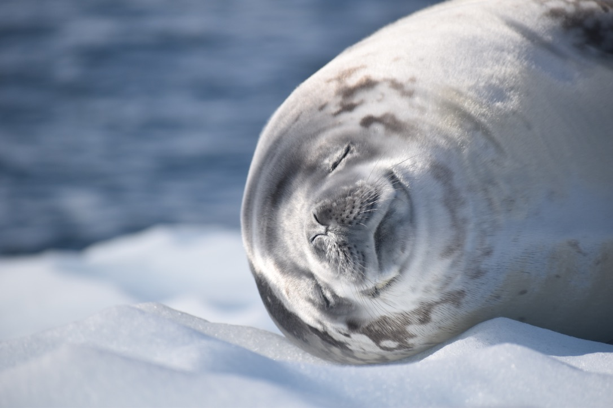
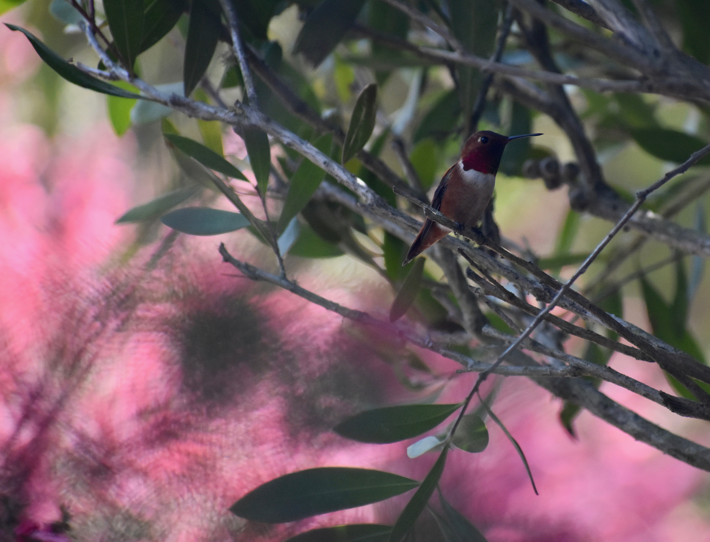
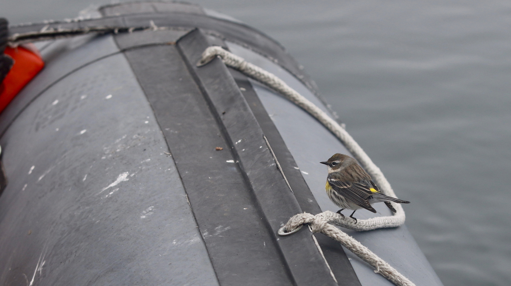
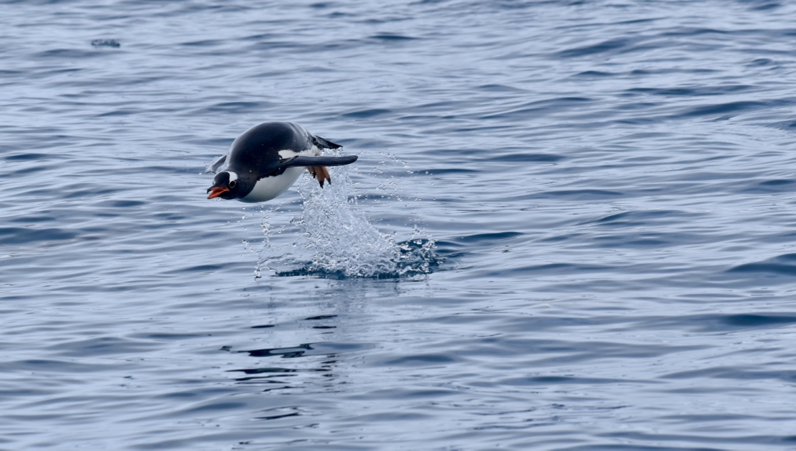
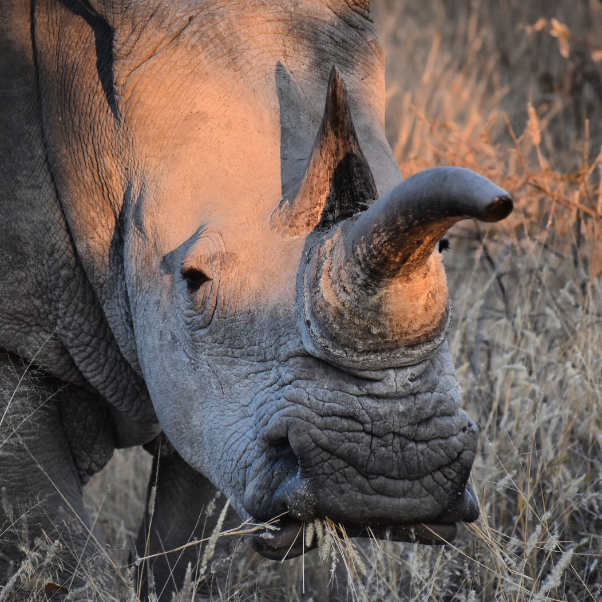

Some photographs of critters from the field and wandering around California

#\newline 

<link rel="stylesheet" href="styles.css" type="text/css">

A weddell seal (*Leptonychotes weddellii*) naps on an iceberg near Port Charcot, Western Antarctic Peninsula.

#\newline 

A great blue heron (*Ardea herodias*) grabs a meal on the outskirts of a golf course in Central California. Do these dramatically altered landscapes benefit predators (like the heron, or white-tailed kites) that ambush from above?

#\newline 

A rufous hummingbird (*Selasphorus rufus*) spotted in the Del Monte Forest, CA.

#\newline  

A white-tailed kite (*Elanus leucurus*) hunts at dusk over an open field in Stanford, CA.

#\newline  

Strong offshore winds creating formidable waves on the Monterey Peninsula.

#\newline  

An adventurous yellow-rumped warbler (*Setophaga coronata*) joins the team for some blue whale tagging offshore in Monterey Bay, CA.

#\newline 

A Botta's pocket gopher (*Thomomys bottae*) emerges from its burrow in Stanford, CA, wary of potential predators.

#\newline 

A gentoo penguin (*Pygoscelis papua*) surfaces for a breath along the Western Antarctic Peninsula.

#\newline 

A white rhinoceros (*Ceratotherium simum*) grazes just before sundown in Namibia.

#\newline 

A black-footed albatross (*Phoebastria nigripes*) glides over the rolling swell of Monterey Bay, CA.

