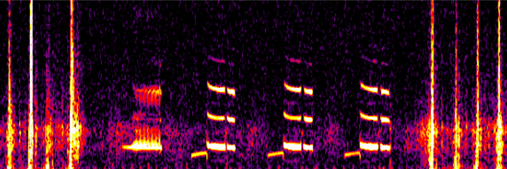

<link rel="stylesheet" href="styles.css" type="text/css">

For my PhD thesis research, I explore the connections between individual and population-scale behavior (social cues) and between population-scale behavior and environment (oceanographic drivers). More specifically, I track blue whale foraging and migratory behavior to investigate these connections. I also interrogate the viability of combining such real-time information on animal behavior with information on human resource use to manage multiple uses of marine (and sometimes terrestrial!) ecosystems dynamically in space and time.

In this work, I am co-advised by [Dr. Jeremy Goldbogen](https://goldbogen.stanford.edu/) and [Dr. Larry Crowder](https://crowderlab.stanford.edu/) and collaborate closely with researchers at the [Monterey Bay Aquarium Research Institute (MBARI)](https://www.mbari.org/technology/solving-challenges/persistent-presence/mars-hydrophone/) and [Cascadia Research Collective](http://www.cascadiaresearch.org/). 

.\label{figurelabel}](images/tag2.png)

My interests in connecting environmental variability, animal behavior, and human-wildlife interactions extend beyond the blue whale focus of my dissertation to a variety of relevant research projects and collaborations. Some of my other current projects include:

* __A comparative analysis of dynamic management in marine and terrestrial systems__ (Project lead, manuscript in press):
    * This project compares the scales of forecasting and implementation of spatially and temporally dynamic resource management and conservation programs (often termed "Dynamic Ocean Management" in marine systems) across marine and terrestrial systems. 

#\newline 

* __Value typologies in protecting Areas Beyond National Jurisdiction (ABNJ)__
(Project collaborator; led by Millie Chapman)
    * This project focuses on a critical assessment of optimization schemes for protecting the high seas. Many science and advocacy organizations tout "30% protection of ABNJ by 2030", but whose values are reflected in the algorithmic approaches to selecting this 30%? We focus on injecting a variety of different "value typologies" into such conservation optimization schemes in order to accurately present tradeoffs in these conservation decisions.
  
#\newline

* __Moving beyond adaptive capacity to understand drivers observable small-scale fishing community responses to environmental change__ (Project co-lead with members of the Crowder Lab)
    * This primarily social science project aims to build upon adaptive capacity literature by documenting, comparing, and understanding observed responses of small-scale fishing communities around the globe to environmental change. Both a published book chapter and a manuscript in review communicate our findings.

#\newline  

* __Soundscapes in Cordell Bank National Marine Sanctuary__ (Project collaborator; led by Samara Haver)
    * This collaborative project with researchers from Oregon State University and NOAA aims to characterize the soundscape of Cordell Bank National Marine Sanctuary. I primarily contribute analytical methods for quantifying baleen whale contributions to this soundscape, and interpretation of variability in their acoustic presence.
    
#\newline 

* __Improving and expanding biodiversity surveys for the [National Ecological Observatory Network (NEON)](https://www.neonscience.org/) via machine learning__ (Project collaborator; led by Dr. Justin Kitzes)
    * This terrestrial ecosystem-focused project aims to improve the capabilities of NEON via new instrumentation and methods. I contribute primarily to improvements in passive acoustic monitoring.

#\newline 

* And more on bioacoustics, migration, and natural resource management!

Before my research at Stanford, I conducted a variety of research projects in biological oceanography and marine ecology as a BS/MS student (Northwestern) and research technician (WHOI):

* Quantification of mesoscale spatial variability and error of ocean color measurements from the MODIS/Aqua and SeaWiFS satellites.

#\newline 

* Refinement of our understanding of the effects of colored dissolved organic matter (CDOM) source on its quantification, and the ramifications for light attenuation modeling in coastal oceans.

#\newline 

* Development and application of a coral bleaching response index (BRI) for cross-comparison of bleaching records on disparate scales from around the globe.